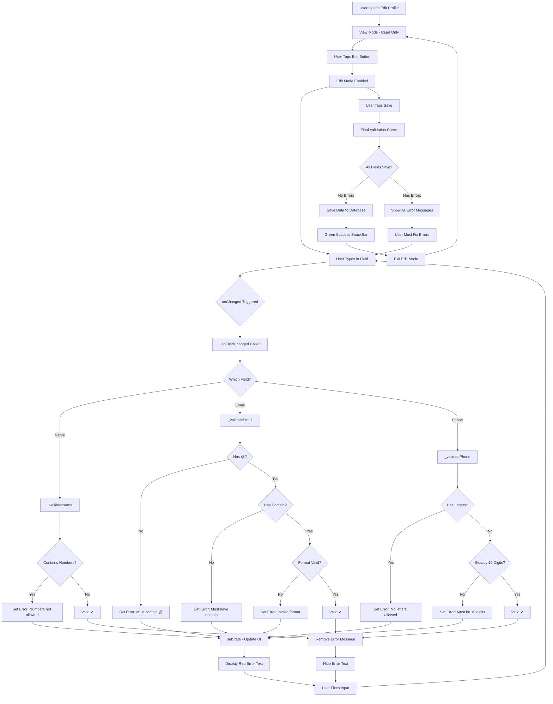
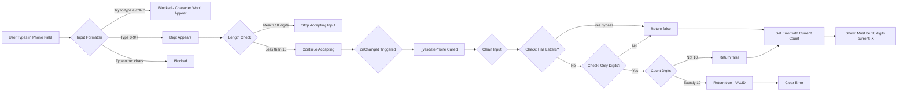
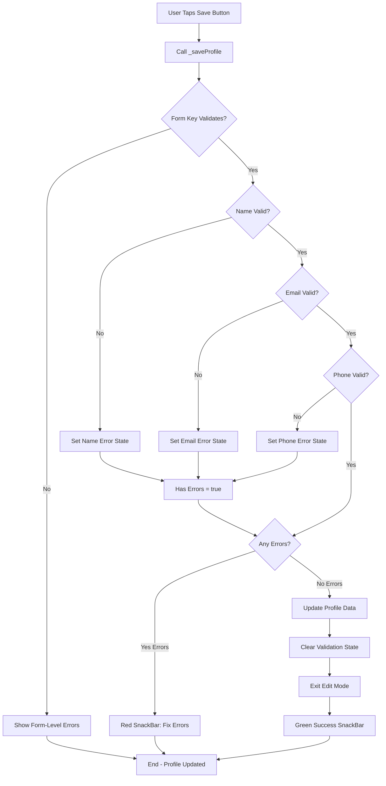
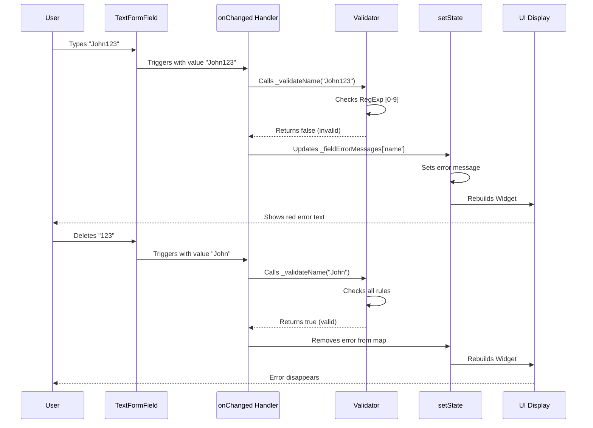
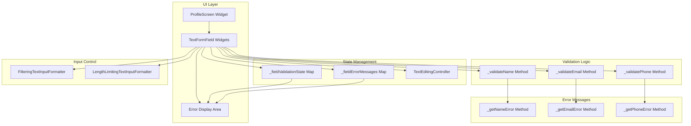
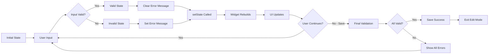
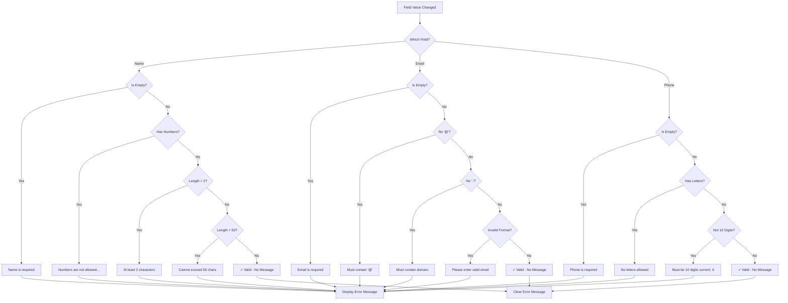

# Profile Validation Flow Diagram

## Visual Representation of the Validation Process

---

## 📊 Complete Validation Flow



---

## 🔍 Detailed Field-Specific Flows

### Name Field Validation Flow

```mermaid
graph LR
    A[User Types in Name Field] --> B{Input Formatter Check}
    B -->|Try to type 0-9| C[Blocked by FilteringTextInputFormatter]
    B -->|Type letters/spaces| D[Character Appears]
    
    D --> E{onChanged Triggered}
    E --> F[_validateName Called]
    
    F --> G{Check: Contains Numbers?}
    G -->|Yes via paste| H[Return false]
    G -->|No| I{Check: Length >= 2?}
    
    I -->|No| J[Return false]
    I -->|Yes| K{Check: Length <= 50?}
    
    K -->|No| L[Return false]
    K -->|Yes| M{Check: Has Letters?}
    
    M -->|No| N[Return false]
    M -->|Yes| O[Return true - VALID]
    
    H --> P[Set Error Message]
    J --> P
    L --> P
    N --> P
    O --> Q[Clear Error Message]
    
    P --> R[Display: "Numbers are not allowed..."]
    Q --> S[No Error Shown]
```

### Email Field Validation Flow

```mermaid
graph TD
    Start[User Types in Email Field] --> Layer1{Layer 1: Contains @?}
    
    Layer1 -->|No| Error1[Error: Must contain @ symbol]
    Layer1 -->|Yes| Layer2{Layer 2: Contains . ?}
    
    Layer2 -->|No| Error2[Error: Must contain domain]
    Layer2 -->|Yes| Layer3{@ Before Last . ?}
    
    Layer3 -->|No| Error3[Error: Invalid format]
    Layer3 -->|Yes| Layer4{Text Before @?}
    
    Layer4 -->|No| Error4[Error: Must have text before @]
    Layer4 -->|Yes| Layer5{Text After @?}
    
    Layer5 -->|No| Error5[Error: Must have domain after @]
    Layer5 -->|Yes| Layer6{TLD Length >= 2?}
    
    Layer6 -->|No| Error6[Error: Domain extension too short]
    Layer6 -->|Yes| Layer7{RegExp Pattern Match?}
    
    Layer7 -->|No| Error7[Error: Please enter valid email]
    Layer7 -->|Yes| Valid[VALID ✓ - No Error]
    
    Error1 --> Display[Show Error Message]
    Error2 --> Display
    Error3 --> Display
    Error4 --> Display
    Error5 --> Display
    Error6 --> Display
    Error7 --> Display
    Valid --> Clear[Clear Error Message]
```

### Phone Number Field Validation Flow



---

## 💾 Save Process Flow



---

## 🎯 Real-Time Error Display Flow



---

## 🏗️ Architecture Diagram



---

## 📱 User Journey Map

```
┌─────────────────────────────────────────────────────────────────┐
│                    USER JOURNEY: EDIT PROFILE                   │
└─────────────────────────────────────────────────────────────────┘

Phase 1: VIEW MODE
┌──────────────┐
│ User opens   │
│ profile      │
│ screen       │
└──────┬───────┘
       │
       ▼
┌──────────────┐
│ Sees read-   │
│ only info    │
└──────┬───────┘
       │
       ▼
┌──────────────┐
│ Decides to   │
│ edit         │
└──────┬───────┘
       │
       └──────────────────┐
                          │
                          ▼
Phase 2: ENABLE EDIT     │
┌──────────────┐          │
│ Taps Edit    │◄─────────┘
│ button       │
└──────┬───────┘
       │
       ▼
┌──────────────┐
│ Fields      │
│ become      │
│ editable    │
└──────┬───────┘
       │
       └──────────────────┐
                          │
                          ▼
Phase 3: INPUT & ERROR   │
┌──────────────┐          │
│ Types in     │◄─────────┘
│ name field   │
└──────┬───────┘
       │
       ▼
┌──────────────┐
│ Types        │
│ "John123"    │
└──────┬───────┘
       │
       ▼
┌──────────────┐
│ RED ERROR    │
│ APPEARS:     │
│ "Numbers are │
│ not allowed" │
└──────┬───────┘
       │
       ▼
┌──────────────┐
│ User notices │
│ error        │
└──────┬───────┘
       │
       └──────────────────┐
                          │
                          ▼
Phase 4: CORRECTION      │
┌──────────────┐          │
│ Deletes      │◄─────────┘
│ "123"        │
└──────┬───────┘
       │
       ▼
┌──────────────┐
│ ERROR        │
│ DISAPPEARS   │
│ (real-time)  │
└──────┬───────┘
       │
       ▼
┌──────────────┐
│ Continues    │
│ typing valid │
│ data         │
└──────┬───────┘
       │
       │ (repeat for email, phone)
       ▼
Phase 5: SAVE ATTEMPT
┌──────────────┐
│ All fields   │
│ look valid   │
└──────┬───────┘
       │
       ▼
┌──────────────┐
│ Taps "Save   │
│ Changes"     │
└──────┬───────┘
       │
       ▼
┌──────────────┐
│ System runs  │
│ final        │
│ validation   │
└──────┬───────┘
       │
       ├─────────────┬────────────┐
       │             │            │
       ▼             ▼            ▼
┌──────────┐  ┌──────────┐ ┌──────────┐
│ ALL      │  │ SOME     │ │ ALL      │
│ VALID ✓  │  │ INVALID  │ │ INVALID  │
└────┬─────┘  └────┬─────┘ └────┬─────┘
     │             │             │
     ▼             ▼             ▼
┌──────────┐  ┌──────────┐ ┌──────────┐
│ GREEN    │  │ RED      │ │ RED      │
│ SUCCESS  │  │ SNACKBAR │ │ SNACKBAR │
│ MESSAGE  │  │ + errors │ │ + errors │
└────┬─────┘  └────┬─────┘ └────┬─────┘
     │             │             │
     ▼             ▼             ▼
┌──────────┐  ┌──────────┐ ┌──────────┐
│ Exit     │  │ User     │ │ User     │
│ Edit     │  │ fixes    │ │ fixes    │
│ Mode     │  │ errors   │ │ errors   │
└────┬─────┘  └────┬─────┘ └────┬─────┘
     │             │             │
     ▼             ▼             ▼
┌──────────┐  ┌──────────┐ ┌──────────┐
│ Profile  │  │ Tries    │ │ Tries    │
│ Updated! │  │ Save     │ │ Save     │
└──────────┘  └──────────┘ └──────────┘
```

---

## 🔄 State Management Cycle



---

## 🎨 Visual Feedback States

```
┌────────────────────────────────────────────────────┐
│                FIELD STATES                        │
└────────────────────────────────────────────────────┘

STATE 1: EMPTY (Required Field)
┌─────────────────────────────────┐
│ Full Name                       │
│                                 │
│ Enter your full name            │
│                                 │
└─────────────────────────────────┘
       │
       ▼ (user focuses)
┌─────────────────────────────────┐
│ Full Name                       │
│ │                               │
│                                 │
│                                 │
└─────────────────────────────────┘

STATE 2: TYPING INVALID (Real-Time Error)
┌─────────────────────────────────┐
│ Full Name                       │
│ John123                         │
│                                 │
│ Numbers are not allowed in the  │
│ name field.                     │
└─────────────────────────────────┘
       │
       ▼ (user deletes numbers)
┌─────────────────────────────────┐
│ Full Name                       │
│ John                            │
│                                 │
│                                 │
└─────────────────────────────────┘

STATE 3: VALID (No Error)
┌─────────────────────────────────┐
│ Full Name                  ✓    │
│ John Doe                        │
│                                 │
│                                 │
└─────────────────────────────────┘

STATE 4: SAVE ATTEMPT WITH ERRORS
┌─────────────────────────────────┐
│ Full Name                       │
│ John                            │
│ Name must be at least 2 chars   │
├─────────────────────────────────┤
│ Email Address                   │
│ userexample.com                 │
│ Email must contain '@' symbol   │
├─────────────────────────────────┤
│ Phone Number                    │
│ 12345                           │
│ Must be exactly 10 digits       │
│ (current: 5)                    │
└─────────────────────────────────┘
       │
       ▼ (user fixes all)
┌─────────────────────────────────┐
│ Full Name                  ✓    │
│ John Doe                        │
├─────────────────────────────────┤
│ Email Address              ✓    │
│ john@example.com                │
├─────────────────────────────────┤
│ Phone Number               ✓    │
│ 1234567890                      │
└─────────────────────────────────┘
       │
       ▼ (tap save)
┌─────────────────────────────────┐
│ ✓ Profile updated successfully! │
│                      [UNDO]     │
└─────────────────────────────────┘
```

---

## 📋 Error Message Decision Tree



---

This comprehensive flow documentation shows every aspect of how the validation system works visually!
